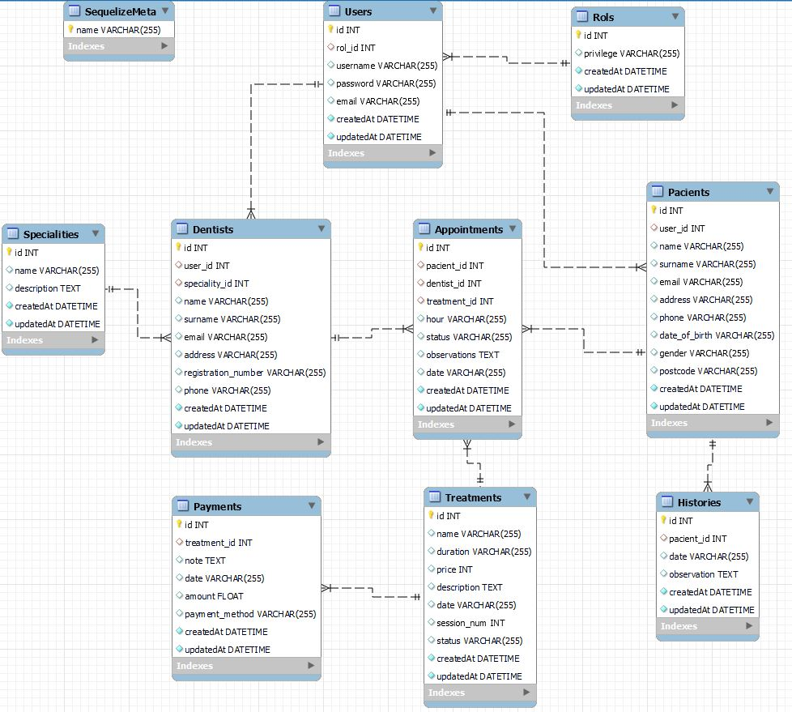

# Welcome to my backend app

<details>
  <summary>Contenido 📝</summary>
  <ol>
    <li><a href="#objetivo">Objective</a></li>
    <li><a href="#sobre-el-proyecto">About the project</a></li>
    <li><a href="#deploy🚀">Installation</a></li>
    <li><a href="#stack">Stack</a></li>
    <li><a href="#diagrama-bd">Diagram</a></li>
    <li><a href="#instalación-en-local">Installation</a></li>
    <li><a href="#endpoints">Endpoints</a></li>
    <li><a href="#futuras-funcionalidades">Future functionalities</a></li>
    <li><a href="#estado">Project status</a></li>
    <li><a href="#contribuciones">Contributions</a></li>
    <li><a href="#licencia">License</a></li>
    <li><a href="#webgrafia">References</a></li>
    <li><a href="#conclusion">Conclusion</a></li>
    <li><a href="#agradecimientos">Acknowledgments</a></li>
    <li><a href="#contacto">Contacto</a></li>

  </ol>
</details>

## Objective
This project required a functional API connected to a database for a business, in this case a dental clinic, with one-to-many, one-to-one and many-to-many relationships as well as verification tokens for access to certain sections of the clinic's website depending on the type of user.
## About the project
We have created an api connected to your database for a veterinary clinic where the user can register and login, as well as access different parts of the database depending on the type of user that has been registered.

## Installation 🚀
 ```
    $ npm install express nodemon dotenv sequelize-cli sequelize sequelize bcrypt jsonwebtoken
```

## Stack
Technologies used:
<div align="center">
<a href="https://www.expressjs.com/">
    
</a>
<a href="https://nodejs.org/es/">
    
</a>
<a href="https://developer.mozilla.org/es/docs/Web/JavaScript">
    
</a>
 </div>

## Diagram BD


## Installation in local
1. Clone the repository
2. ` $ npm install `
3. We connect our repository with the database 
4. ``` $ Run the ``` migrations ```. 
5. ``` $ Execute the seeders ``` 6. 
6. ``` $ npm run dev ``` $ npm run dev ``` 
7. ...

## Endpoints
<details>
<summary>Endpoints</summary>

- AUTH

    - LOGIN

            POST http://localhost:3000/login  
        body:
        ``` js
            {
                "user": "Ramon",
                "email": "ramon@ramon.com",
                "password": "123456"
            }
        ```
- ROL

    - CREATE

            POST http://localhost:3000/rols 
        body:
        ``` js
            {
                "privilege" : "admin"
            }
        ```
    - OTHER

           - GET http://localhost:3000/rols/1

- USER

    - CREATE

            POST http://localhost:3000/users 
        body:
        ``` js
            {
                "rol_id" : "2",
                "username" : "amanciolodo",
                "password" : "9778dd77234ff",
                "email" : "amanciolado@gmail.com"
            }
        ```
    - OTHER

           - GET http://localhost:3000/users/1
           - PUT http://localhost:3000/users/1
           - DELETE http://localhost:3000/users/1

- DENTIST

    - CREATE

            POST http://localhost:3000/dentists
        body:
        ``` js
            {
                "user_id" : "2",
                "speciality_id" : "1",
                "name" : "carlos",
                "surname" : "gonzalez",
                "email" : "amancio@gmail.com",
                "address" : " Av casalduch",
                "registration_number" : "98675623gh19",
                "phone" : "76575756745"
            }
        ```
    - OTHER

           - GET http://localhost:3000/dentists
           - GET http://localhost:3000/dentists/1
           - PUT http://localhost:3000/dentists/1
           - DELETE http://localhost:3000/dentists

- PACIENT

    - CREATE

            POST http://localhost:3000/pacients
        body:
        ``` js
            {
                
                "user_id" : "4",
                "name" : "david",
                "surname" : "ramirez",
                "email" : "shasajb@gmail.com",
                "address" : "av casalduch",
                "phone" : "765977679",
                "date_of_birth" : "06/06/1995",
                "gender" : "male",
                "postcode" : "12005"
            }
        ```
    - OTHER

           - GET http://localhost:3000/pacients
           - GET http://localhost:3000/pacients/1
           - PUT http://localhost:3000/pacients/1
           - DELETE http://localhost:3000/pacients

- SPECIALITY

    - CREATE

            POST http://localhost:3000/specialities
        body:
        ``` js
            {
                "name" : "odontologo",
                "description" : "el mejor dentista",
            }
        ```
    - OTHER

           - GET http://localhost:3000/specialities

- HISTORY

    - CREATE

            POST http://localhost:3000/histories
        body:
        ``` js
            {
                "pacient_id" : "1",
                "date" : "28/02/2023",
                "observation" : "its ok in this clinic"
            }
        ```
    - OTHER

           - GET http://localhost:3000/histories/1
           - PUT http://localhost:3000/histories/1

- APPOINTMENT

    - CREATE

            POST http://localhost:3000/appointment
        body:
        ``` js
            {
                "pacient_id" : "1",
                "dentist_id": "3",
                "treatment_id" : "1",
                "hour" : "09:00",
                "status" : "complete",
                "observations" : "alone jasbdkasdhladsasda",
                "date": "08/05/2020"
            }
        ```
    - OTHER

           - GET http://localhost:3000/appointments
           - GET http://localhost:3000/appointments/1
           - PUT http://localhost:3000/appointments/1
           - DELETE http://localhost:3000/appointments/1

- TREATMENT

    - CREATE

            POST http://localhost:3000/treatments
        body:
        ``` js
            {
                "name" : "quitar empaste",
                "duration" : "3 horas",
                "price" : "75",
                "description" : "ajhgasdvajshydfvashduj",
                "date" : "765977679",
                "session_num" : "10",
                "status" : "pending"
                        }
        ```
    - OTHER

           - GET http://localhost:3000/treatments/1
           - PUT http://localhost:3000/treatments/1

- PAYMENT

    - CREATE

            POST http://localhost:3000/payments
        body:
        ``` js
            {
                "name" : "quitar empaste",
                "duration" : "3 horas",
                "price" : "75",
                "description" : "ajhgasdvajshydfvashduj",
                "date" : "765977679",
                "session_num" : "10",
                "status" : "pending"
            }
        ```
    - OTHER

           - GET http://localhost:3000/payments/1
                      

</details>

## Future functionalities
- Control all access to each of the routes through tokens
- Add future additional tables to the database

## Project status
Project under construction

## Contributions
Suggestions and contributions are always welcome.  

You can do this in two ways:

1. Opening an issue
2. Create a fork of the repository
    - Create a new branch  
        ```
        $ git checkout -b feature/username-improvement
        ```
    - Commit your changes 
        ```
        $ git commit -m 'feat: enhancement X thing'
        ```
    - Push to the branch 
        ```
        $ git push origin feature/user-name-improvement
        ```
    - Open a Pull Request

## License
This project is under MIT License.

## References
To achieve my goal I have gathered information from:

- Sequelize: https://sequelize.org/
- Npm: https://www.npmjs.com/

## Conclusion
We managed to raise and develop the proposed objective of creating an api connected to its database for a veterinary clinic using sequelize node and javascipt technologies. It addressed the main aspects of the project. as the possibility of registration and login, modification and deletion of appointments, and display of treatments, access via tokens to different routes etc..

It was possible to identify the main design problems of the database, the various difficulties that arose especially with the method of verification of the token and the different relationships between the tables of the database that were managed to address adequately so that all the functionalities foreseen in the basic design of the project were correctly carried out.

## Acknowledgments

I thank my colleagues for their time dedicated to this project:

- **Adrián**  
<a href="https://www.github.com/solsona1008/" target="_blank"></a>

- ***Jose Ramón***  
<a href="https://www.github.com/JRamonS/" target="_blank"></a> 

## Contact

<a href = "mailto:solsona1008@gmail.com"></a>
<a href="https://www.linkedin.com/in/adrian-solsona-miralles-415b27182/" target="_blank"></a> 
</p>
